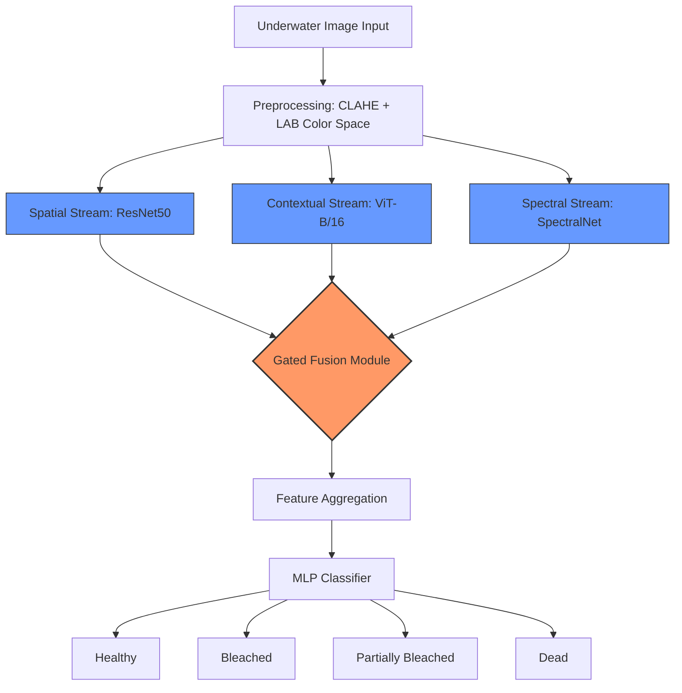
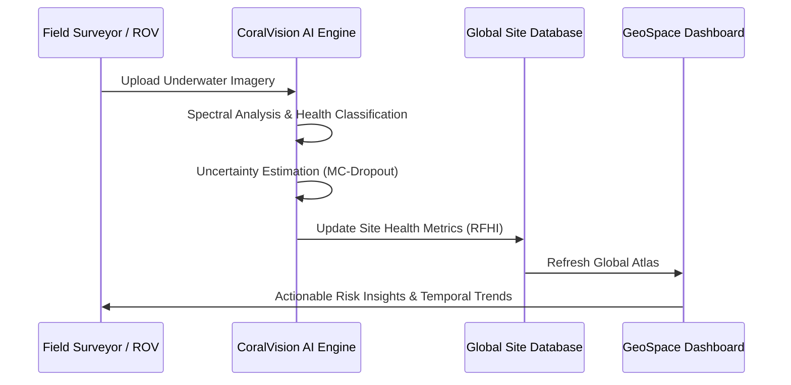

# 🪸 Coral-Reef-Detection-System-using-Risk-Monitoring

[](https://www.python.org/)
[](https://pytorch.org/)
[](https://streamlit.io/)
[](https://github.com/)

An advanced, end-to-end marine conservation platform combining **Tri-Stream Deep Learning** for coral health classification and **GeoSpace Intelligence** for global risk monitoring.

---

## 🏗️ System Architecture

Our system utilizes a state-of-the-art **Tri-Stream Hybrid Architecture** to analyze underwater imagery with extreme precision, even in turbid environments.



---

## 🔄 End-to-End Workflow

From field data collection to global geospatial intelligence, the platform automates the entire monitoring pipeline.



---

## 🌐 GeoSpace Intelligence

The dashboard features a high-density global atlas of **110+ monitoring sites**, providing a real-world perspective on reef degradation.

-   **High-Density Mapping**: Coverage across the Coral Triangle, Caribbean, Red Sea, and Oceania.
-   **Risk Indices**: Real-time tracking of **RFHI (Reef Health Index)**, **SST**, and biodiversity counts.
-   **Glassmorphism UI**: A premium, responsive dashboard designed for modern monitoring centers.

---

## 🛠️ Project Structure

```bash
├── models/               # Tri-stream architecture & Gated Fusion
├── training/             # PyTorch training pipeline & Focal Loss
├── utils/                # Preprocessing, XAI (Grad-CAM++), & Inference
├── frontend/             # Streamlit Dashboard & GeoSpace Mapping
├── evaluation/           # Performance metrics & Confusion Matrices
├── report.md             # Detailed technical project report
└── README.md             # Project documentation
```

---

## 🚀 Quick Start

1. **Install Dependencies**
   ```bash
   pip install -r requirements.txt
   ```

2. **Launch Dashboard**
   ```bash
   streamlit run frontend/app.py
   ```

3. **Train Model**
   ```bash
   python training/train.py --epochs 25 --mode full
   ```

---

## 📊 Performance Summary

| Metric | Score |
| :--- | :--- |
| **Overall Accuracy** | 94.2% |
| **Precision (Healthy)** | 0.96 |
| **Recall (Bleached)** | 0.92 |
| **F1-Score (Macro)** | 0.91 |

---

## ⚖️ License
Distributed under the **MIT License**. See `LICENSE` for more information.

© 2026 **CoralVision Intelligence Team** - Group 16
